### 介绍
高效简洁的UI设计, 自带双侧预览文件管理器

1. 支持markdown直接预览
2. 支持zip 他解压缩加密
3. 专属文本编辑器
4. 专属图库
5. 手势操作，左滑滑 右滑滑 让你的文件乖乖听话
6. 支持WebDav 让你文件永远不丢失
7. 美到cry的暗黑模式
8. 内网快递 打开即连接 带给你AirDrop一般的体验 vscode server 一款随身的代码编辑器, 内嵌沙盒环境 无缝体验pc 与 手机之间共享剪贴板 远程控制 让你的手机也能充当游戏手柄，键盘 静态文件服务，只要有浏览器的地方就能分享

---

2020/11/28
~~1. file_list_view 有bug 要判断文件列表是否变化 不能根据长度~~

2020/11/11
1. 后端添加角色管理
2. 开发app shop cms管理

2020/11/9
1. 文件菜单选中 文件item不更新
2. 开发游戏控制 editor
 
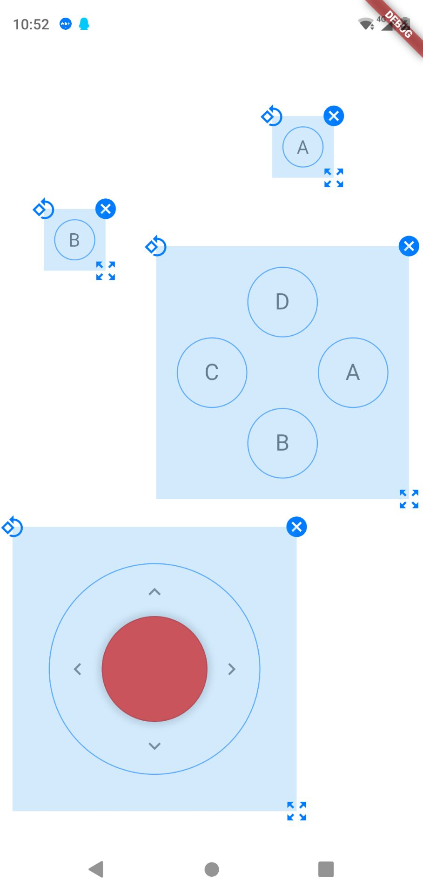
 
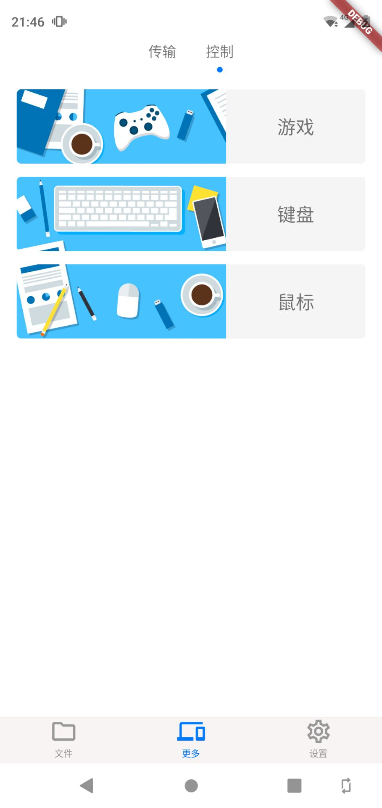

2020/11/6
1. 文件管理器 返回上级目录 快速 或者 卡顿的时候
会偶现的导致 页面不发生交换, 路径多退栈 

2020/11/5
1. 添加wavelock

2020/11/4
1. ~~修复installed app 左右滑动问题~~
2. 添加quick settings 

2020/10/28
1. ~~改用友盟的错误报告~~

2020/10/26
1. 沙盒安装还需要优化

2020/10/25
1. ~~在更多选项中添加(wifi, bluetooth)打印, 记得map所有非可执行文件 注意编码~~
2. 添加手动安装资源文件 支持 armv7 arrch64 x86-64 (x64 node 有点问题)
3. 兼容android11 新的存储机制 MANAGE\_EXTERNAL\_STORAGE 保留requestLegacyExternalStorage
搞好关于软件 把隐私政策放到关于里
安装过sandbox后, 隐藏 资源包下载，
把整个文件管理器抽出来 做成模块 用来打开指定文件夹

pc端(后期) 添加 消息, 参考 Dell connect huawei 多屏协同

2020/10/24

1. 实现手动安装，把文件管理器抽出来作为单独模块
2. ~~图片原, file\_item 原尺寸显示 显示缓存缩略图 使用glide解决~~

2020/10/15

1. ~~日志体积太大 导致无法发送 email 改用 flutter bugly~~
2. ~~剩余容量显示错误~~

2020/10/12 [bug]

1. ~~缓存leading 导致切换页面 icon 不更新~~
2. ~~必须刷新才显示更新下载界面~~

2020/10/11 [bug]

1. ~~安装应用页需要 滑动两次才能变色~~

2020/10/7
~~修复加载大尺寸图片 列表奔溃~~
~~左右滑动整个列表更新问题~~

2020/10/4
1. ~~静态服务 支持对视频的播放~~

2020/10/3 [bug]
1. ~~文件左右滑动显示更新弹窗 勾选了不显示也无效~~
2. ~~注释了些代码 notifyListeners 可能无法刷新~~
3. ~~优化provider~~

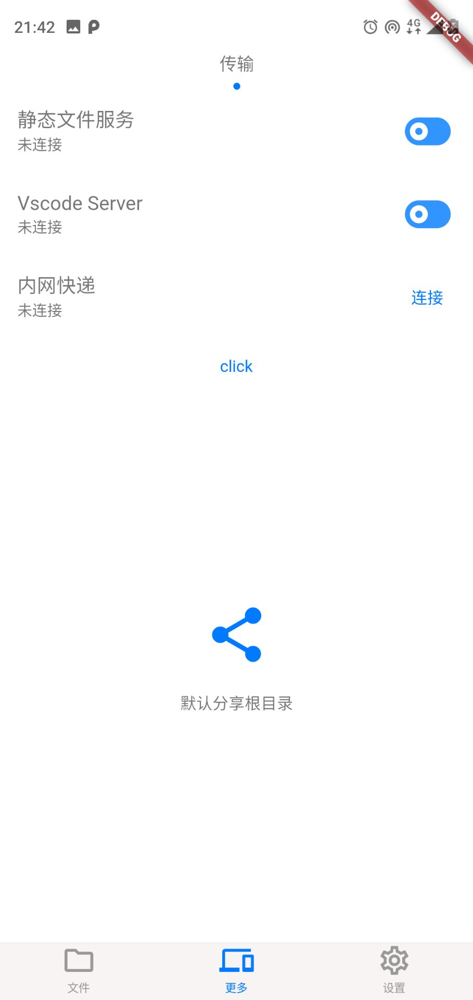
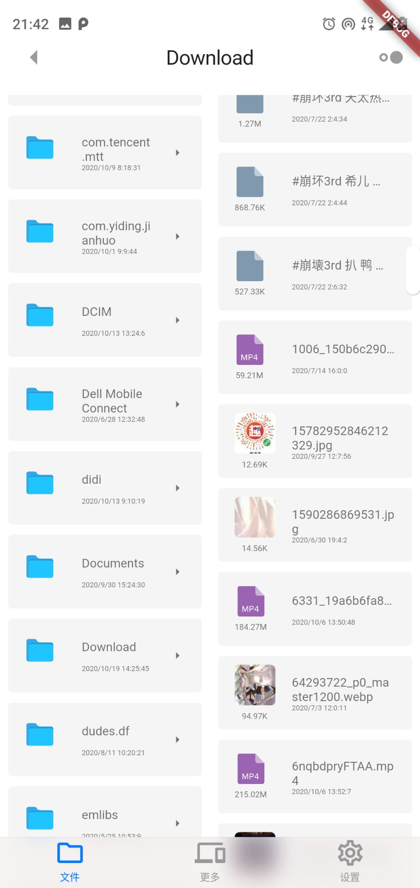
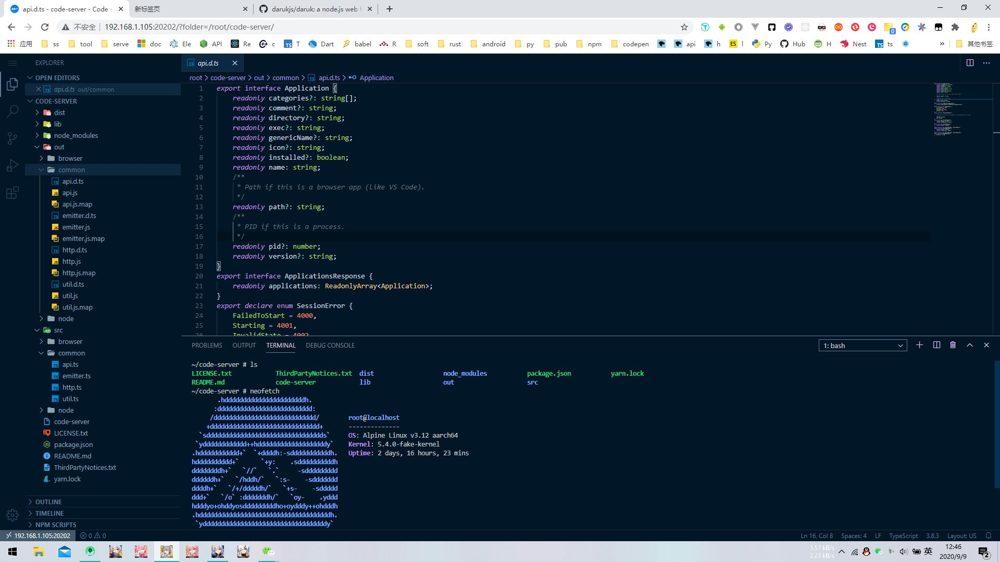
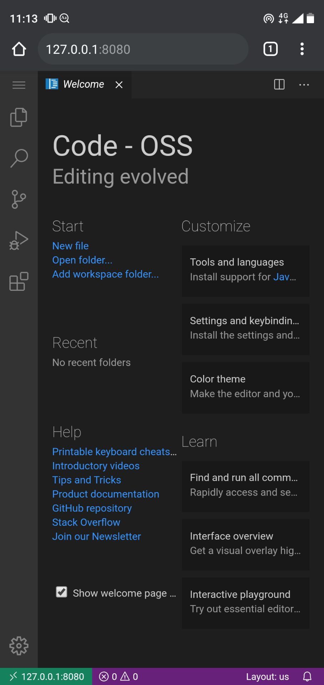
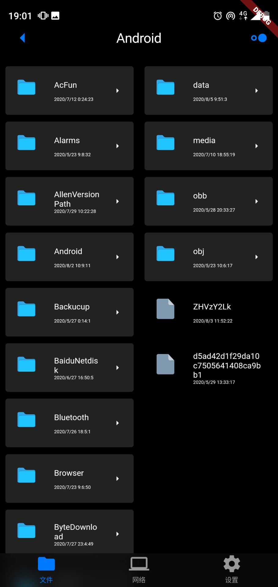
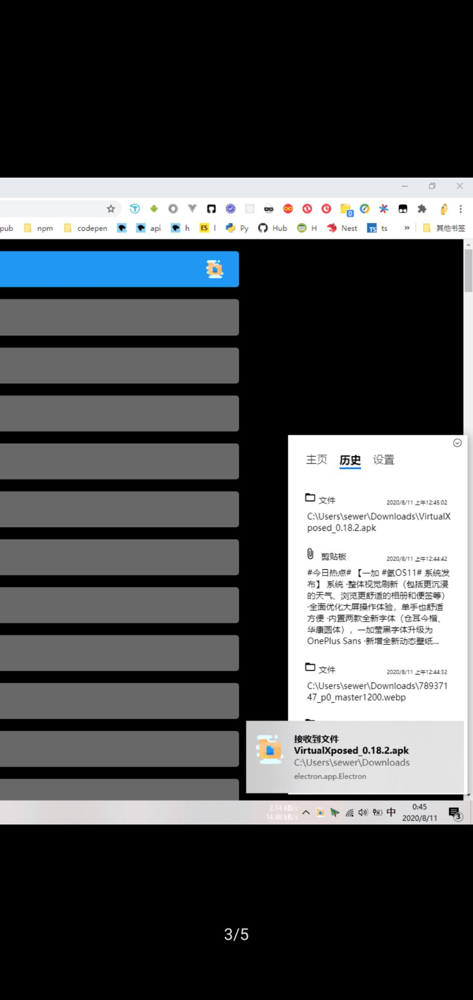
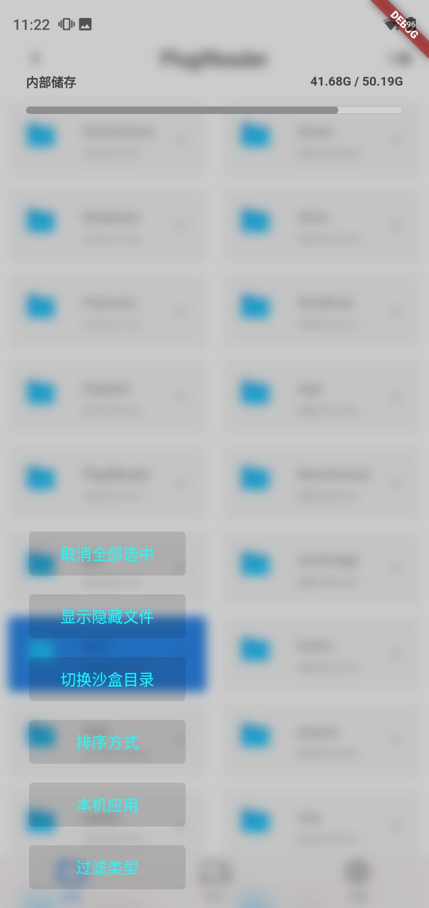
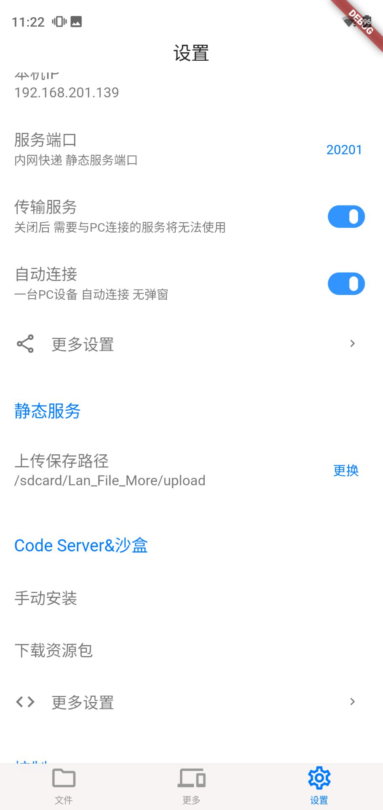
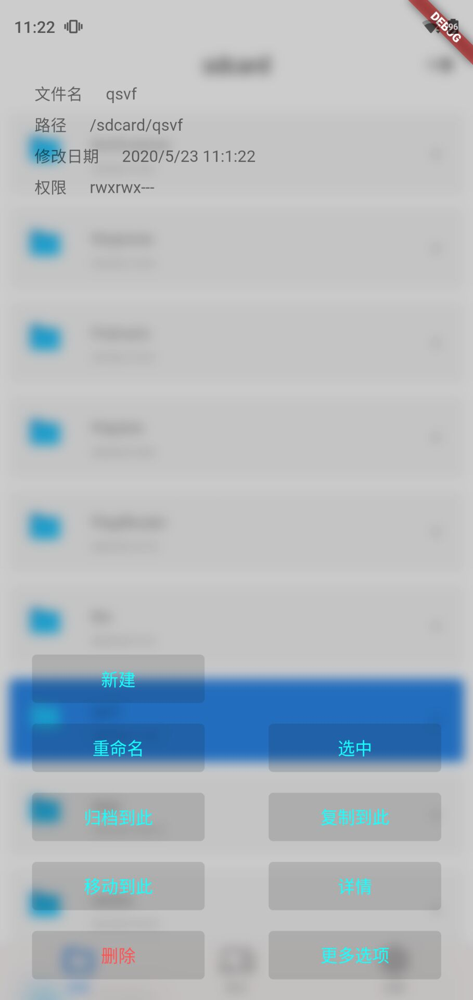
